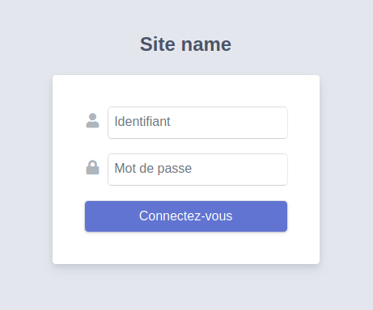

# Authentication
**EasyAdminPlus** is packaged with an authentication layer which allows you to restrict access to the admin area.

## Configuration
Update your **security** settings.

```yaml
security:
    encoders:
        Jacquesndl\EasyAdminPlusBundle\Entity\User: auto
        # ...

    providers:
        jacquesndl_easy_admin_plus:
            entity: { class: 'Jacquesndl\EasyAdminPlusBundle\Entity\User' } 
        # ...

    firewalls:
        jacquesndl_easy_admin_plus:
            pattern: ^/admin
            anonymous: ~
            logout:
                path: jacquesndl_easy_admin_plus_logout
                target: easyadmin
            guard:
                authenticators:
                    - Jacquesndl\EasyAdminPlusBundle\Security\LoginFormAuthenticator
        # ...

    access_control:
        - { path: '^/admin/login', role: IS_AUTHENTICATED_ANONYMOUSLY }
        - { path: '^/admin/', role: ROLE_EASY_ADMIN }
        # ...
```

:exclamation: Make sure that no conflicting firewall is declared before ours.

## Update schema
The bundle uses its own **User** entity. So you need to update the database schema.

```shell
php bin/console doctrine:schema:update -f
```

or 

```shell
php bin/console doctrine:migration:diff
php bin/console doctrine:migration:migrate
```

## Commands

* Create an admin
```shell
php bin/console jacquesndl:easy-admin-plus:user:create admin password
```

```shell
php bin/console jacquesndl:easy-admin-plus:user:create admin password ROLE_EASY_ADMIN_1 ROLE_EASY_ADMIN_2
```

* Remove an admin
```shell
php bin/console jacquesndl:easy-admin-plus:user:remove admin
```

* Add roles to an admin
```shell
php bin/console jacquesndl:easy-admin-plus:user:add-roles admin ROLE_EASY_ADMIN_1 ROLE_EASY_ADMIN_2
```

* Remove roles from an admin
```shell
php bin/console jacquesndl:easy-admin-plus:user:remove-roles admin ROLE_EASY_ADMIN_1 ROLE_EASY_ADMIN_2
```

* Set roles of an admin
```shell
php bin/console jacquesndl:easy-admin-plus:user:set-roles admin ROLE_EASY_ADMIN_1 ROLE_EASY_ADMIN_2
```

* Change admin password
```shell
php bin/console jacquesndl:easy-admin-plus:user:change-password admin password2
```

* Enable an admin
```shell
php bin/console jacquesndl:easy-admin-plus:user:enable admin
```

* Disable an admin
```shell
php bin/console jacquesndl:easy-admin-plus:user:disable admin
 ```

## Login Screen

<p align="center">
    
</p>
  
Next chapter: [Chapter 2 - Additional templates](chapter-2.md)
